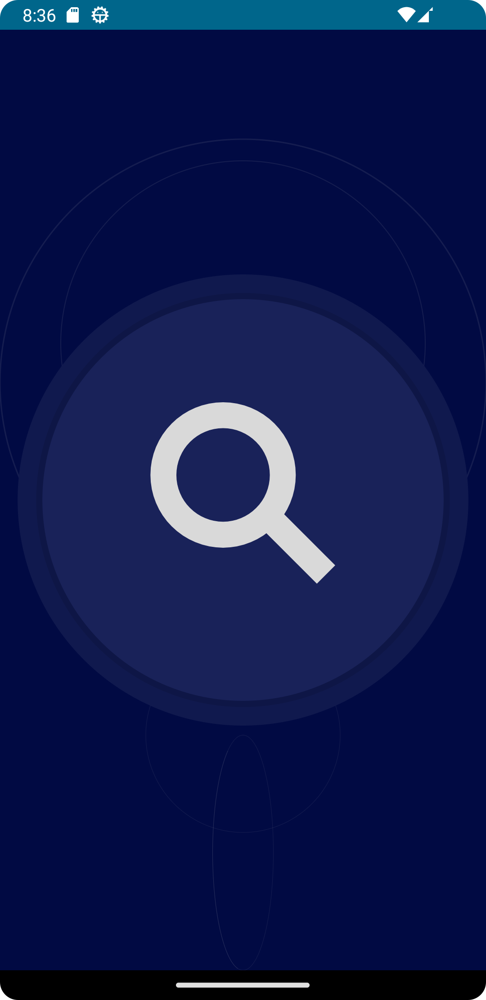
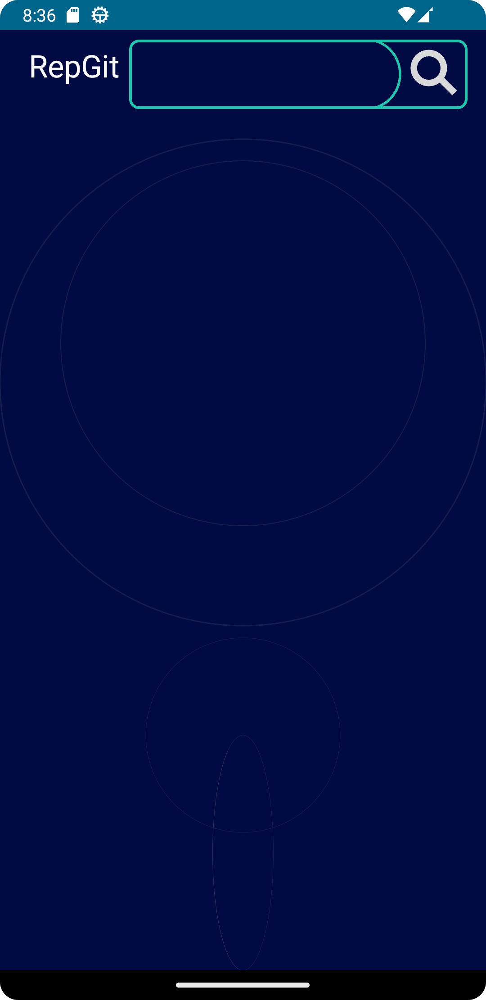
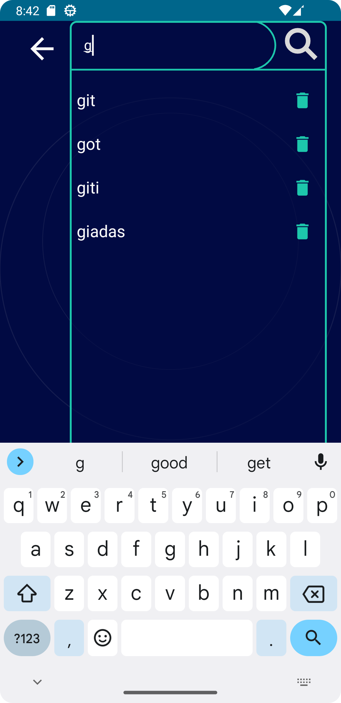
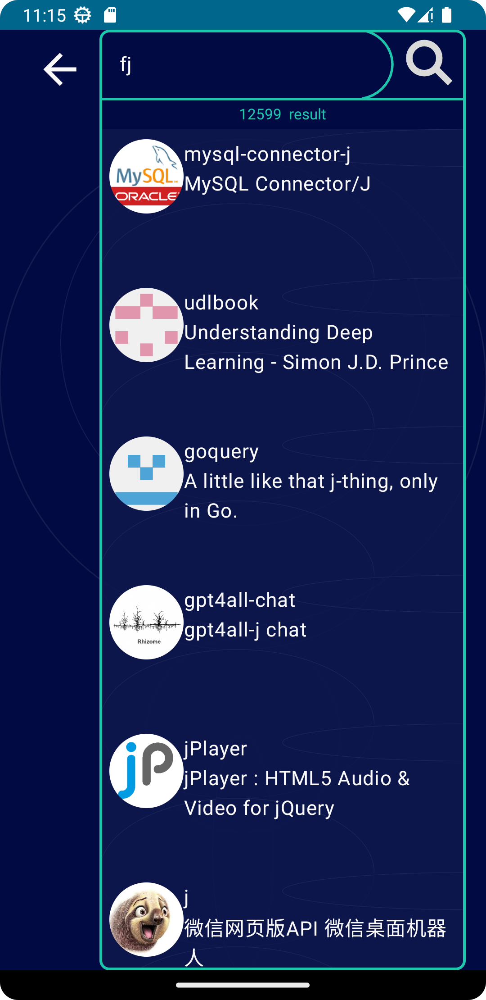
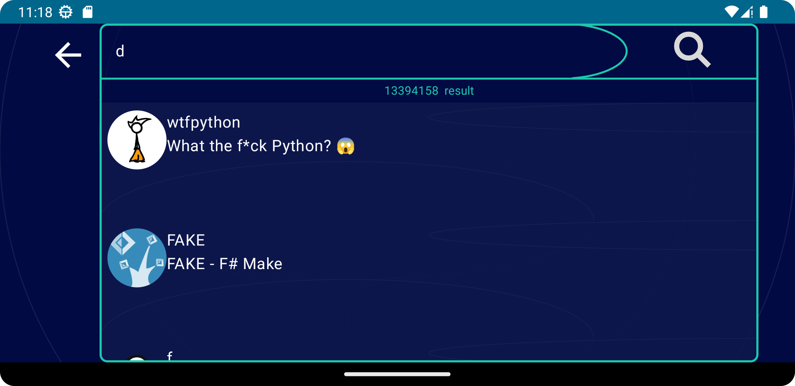
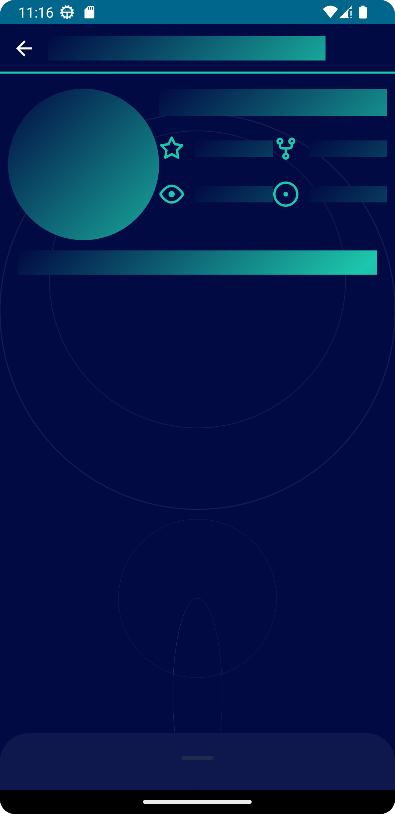
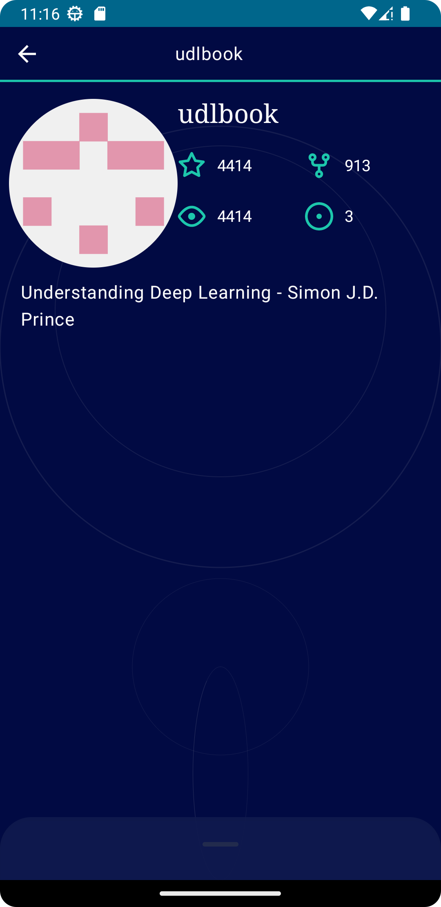
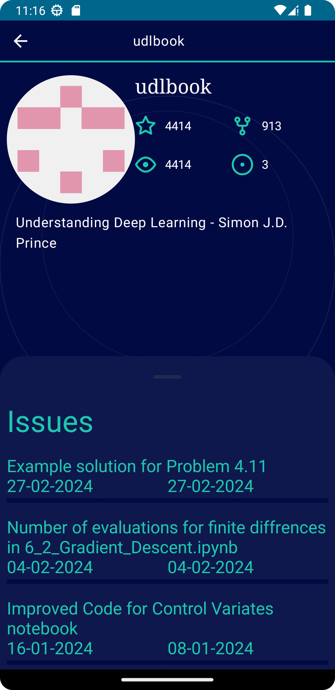
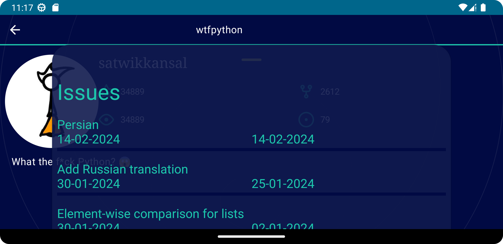

Стек: jetpack compose, koin, coil, ktor, room, moko, ksp.
=================================================================
Процесс сборки:
=================================================================
 1. Для успешной сборки вам необходимо, вставить свой токен доступа в файл  core/build.gradle.kts в 26 строчку
 2. Токен можно получить по ссылкке https://github.com/settings/tokens

Особености:
=================================================================

1. Вас встречает кнопка, ее стоит нажать)

2. Сохранются варианты поиска (  не учитывая автопоиск), то есть если вы введете git,
	   то при следующем вбивание  у вас вылезет вариант git. (за раз может выйти 5 вариантов)
	
3. Issues  лежат в BottomSheet на экране репозитория

Дизайн:
==================================================================

